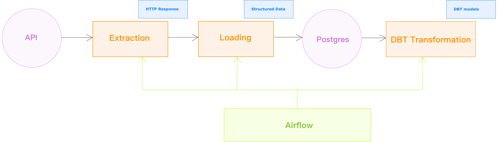

# XKCD Comics Data Pipeline

A robust data pipeline for extracting, loading, and transforming [XKCD](https://xkcd.com/) comic data. This project demonstrates ELT pipeline using modern data stack technologies including Airflow, dbt, and PostgreSQL.

## Project Overview

This data pipeline extracts comic data from the [XKCD API](https://xkcd.com/json.html), load it into Postgres database, and processes it through a series of transformations, producing analytics-ready datasets for business intelligence. 

## Architecture




## Key Components

### 1. Data Extraction

The extraction layer includes:

**XKCDApiHook**: Custom Airflow hook for interacting with XKCD API
- Rate limiting to prevent API abuse
- Fetches comic data with a specific number

**ComicParser**: Transforms raw API responses into structured data
- Data validation and cleaning
- Consistent formatting for database insertion

The pipeline fetches comic data from the XKCD API using XKCDApiHook.
It compares the current latest comic from the database with the latest comic from the API, to find out which comics to fetch.
The fetched comic data (JSON response) is parsed as structured data using ComicParser.

```python
def get_comic_by_num(self, num: int) -> Optional[Dict[str, Any]]:
"""Get comic data by number"""
    try:
        return self._make_request(f"{num}/{XKCD_INFO_ENDPOINT}")
    except requests.exceptions.RequestException as e:
        logger.error(f"Failed to fetch comic #{str(e)}")
        return None
```


### 2. Data Loading

The loading layer includes:

**XKCDPostgresHook**: Extended Airflow PostgreSQL hook for database operations.
- Batch and single record insertion capabilities
- Transaction management with context managers

The pipeline automatically inserts new fetched comic data into the database with minimized API calls and database operations.

#### 2.1. Batch Loading

When executing backfill to the database, the pipe goes for a batch load method, which reduces the ....

```python
def insert_batch_comics(self, comics_data: List[Dict[str, Any]]) -> bool:
    """Insert multiple comics in a single batch operation."""
    insert_query = self.parser.generate_insert_query()
    values = [tuple(comic.values()) for comic in comics_data]
    try:
        with self.get_cursor() as cursor:
            cursor.executemany(insert_query, values) # Use executemany for batch insertion
            comic_nums = [comic.get('num') for comic in comics_data]
            return True
    except Exception as e:
        return False
```

### 3. Data Transformation (DBT)

The transformation layer uses dbt to create:

- **raw_xkcd_comics**: External source. Contains raw data fetched from the XKCD API.
- **stg_xkcd_comics**: Staging table. Performing lightweight cleaning and standardization.
  - Field renaming
  - Addition of 'dbt_updated_at' timestamp
  - Ordering
- **dim_comics**: Dimension table. Contains descriptive attributes of comics.
- **fct_comic_metrics**: Fact table. Contains comic metrics for business analysis.
  - Calculates title_cost_euros (title length × 5)
  - Generates random estimated_views
  - Generates customer_rating (1.0-10.0)
- **fct_monthly_metrics**: Aggregated fact table. Aggregates fct_comic_metrics on month.
  - Calculates monthly comic count (COUNT DISTINCT)
  - Calculates monthly total cost (SUM)
  - Calculates monthly average views (AVG)
  - Calculates monthly average rating (AVG)

#### 3.1. Table Materialization Strategy:

- Staging layer: view
  - lightweight
  - rebuilt on-demand
- Mart layer (Dimension and fact tables): table
  - persistent storage
  - performance optimization

#### 3.2. DBT model dependencies

[DBT model dependencies](https://placeholder-for-pipeline-diagram.png)


### 4. Airflow DAGs

Three DAGs orchestrate the entire pipeline:

1. **xkcd_incremental_update**: Handles data extraction and loading. (Automatically triggered)
2. **xkcd_backfill**: Handles batched data extraction and loading. (Manually triggered for backfill)
3. **dbt_models_run_and_test**: Manages transformation and testing.

#### 4.1. DAG dependencies

[DAG dependencies](https://placeholder-for-pipeline-diagram.png)

#### 4.2. Polling Logic

xkcd_incremental_update automatically runs on Monday, Wednesday, and Friday, which are the days xkcd updates new comics. It always checks for new comics. If there is no new comic, it will keep retrying every 1 hour until it finds a new comic to fetch. This polling logic is implemented using the Airflow task retry mechanism.

```python
@task
@task(
    retries=MAX_POLLING_RETRIES,  # 16 retries (8:00 - 24:00)
    retry_delay=timedelta(minutes=POLLING_INTERVAL_MINUTES),
    retry_exponential_backoff=False,
)
def get_comic_numbers_to_process()
```

## Data Quality

The pipeline includes comprehensive data quality checks:

- **Source validation**:
- **dbt tests**: 

## Setup and Installation

### Prerequisites

- Docker

### Installation

1. Clone the repository:
   ```
   git clone https://github.com/Qingxian089/xkcd-pipeline.git
   cd xkcd-pipeline
   ```

## Usage

1. Create and start all the services
   ```
   docker-compose up -d  # start container
   docker-compose ps     # check container status (alternative: check status in Docker Desktop)
   ```

2. Configure database connection in [Airflow UI](http://localhost:8080):
   ```
   Connection Id: xkcd_postgres
   Connection Type: Postgres
   Host: xkcd-db (Docker service name)
   Schema: xkcd_db (database name)
   Login: xkcd_user
   Password: xkcd_pass
   Port: 5432
   ```

3. Switch on all DAGs


## Future Enhancements

- Alembic migration 
- Cloud Deployment 
- Extra data quality checks (e.g. great expectations)
- fct_comic_metrics is using randomly generated metrics, which should be replaced with real data


## Acknowledgements

- [XKCD Comics](https://xkcd.com/) for providing the API
- The open-source community behind Airflow and dbt

---
